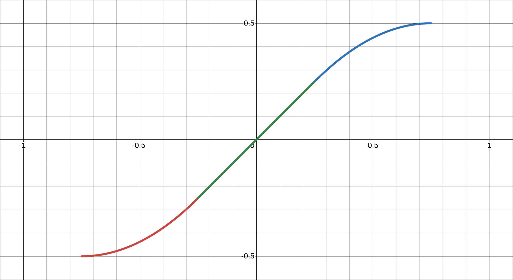

# Elegant Image Gallery Using Partitioned Container Bands

# **Abstract**

Creating web galleries for art collections presents formidable challenges: collection of artworks exhibit highly variable aspect ratios, often comprising hundreds or thousands of images, rendering manual arrangement impractical; and achieving responsive design across devices while preserving visual balance introduces an additional layer of complexity. The Partitioned Container Bands system addresses this challenge by dividing pages into intelligent bands that can be partitioned according to compositional rules; the system automatically selects and positions images based on aspect ratio compatibility. A subsequent optimisation phase further refines partition dimensions to minimise distortion, supporting both horizontal and vertical band orientations, thereby ensuring efficient space utilisation across all device sizes. The outcome is an automated layout engine that transforms chaotic image collections into harmonious and responsive galleries.

# **1. Introduction**

## **1.1 The Challenge of Mixed Aspect Ratio Galleries**

Traditional grid layouts represent the most straightforward approach to organizing image galleries, but their simplicity comes at a significant cost: fixed-size cells force images into predetermined dimensions, resulting in aggressive cropping that can destroy composition, remove critical visual elements, or distort the intended framing of the artist. What should be a showcase becomes a Bed of Procrustes, where artworks are mutilated to fit arbitrary constraints.

The masonry layout, popularised by Pinterest, attempts to address these limitations by allowing variable heights within columnar structures. While this preserves aspect ratios, it introduces new problems: the inherent vertical bias creates a waterfall effect where images flow exclusively downward. This architecture particularly disadvantages landscape-oriented artworks—panoramic photographs, wide paintings, and horizontal compositions are compressed into narrow columns, diminishing their visual impact and violating their natural proportions.

Furthermore, both approaches fail to create meaningful visual relationships between adjacent images. They treat each artwork as an isolated unit rather than part of a cohesive gallery experience. What is needed is a layout system that respects both the individual integrity of each image and the collective harmony of the gallery—one that can accommodate diverse aspect ratios while maintaining visual flow in multiple directions and creating deliberate compositional relationships between neighbouring artworks.

## **1.2 Design Goals**

The Partitioned Container Band system is built on four foundational principles:

1. **Aspect Ratio Preservation with Intelligent Boundaries**
    
    Unlike traditional layouts that force arbitrary crops, the system respects natural proportions of each image while applying mathematical soft-clipping to extreme ratios. This approach prevents both excessive pan-and-scanning of ultra-wide panoramas and dominating vertical scrolls from tall images, achieving visual balance without destroying compositional integrity.
    
2. **Hierarchical Visual Composition**
    
    The system implements an importance-based allocation strategy. High-priority images (scored ≥10) receive prominent placement in main panels with optimal sizing, while lower-scored images intelligently fill complementary spaces. This creates deliberate focal points and supporting elements, mimicking the thoughtful arrangement of a curated gallery rather than a mechanical grid.
    
3. **True Responsive Architecture**
    
    Beyond simple breakpoints, the system employs a virtual column mechanism that fundamentally restructures layouts across devices. A 4-column desktop gallery does not merely compress to mobile—it regenerates with entirely different band arrangements, orientations, and partitioning rules optimised for each screen dimension.
    
4. **Seamless Dynamic Reconstruction**
    
    When viewport changes occur—whether from device rotation, window resizing, or split-screen activation—the system performs complete layout regeneration rather than naive scaling. Bands are re-evaluated, images are re-selected for optimal fit, and partitioning rules are reapplied, ensuring every state maintains the same level of visual sophistication as the initial render.
    

## **1.3 Overview of the Solution**

The Partitioned Container Band system introduces a fundamentally new approach to gallery layout through four interconnected mechanisms that work in concert to create harmonious, responsive image arrangements.

### **Container Bands: The Foundation**

At its core, the system divides the gallery into discrete horizontal or vertical bands—think of them as intelligent rows that can adapt their internal structure. Each band maintains a consistent height (or width when vertical) and can host multiple images through internal partitioning. Unlike rigid grid rows, these bands are living containers that understand their content and can optimise their dimensions accordingly. A single gallery might contain dozens of bands, each potentially following different organisational rules while maintaining overall cohesion.

### **Rule-Based Partitioning Architecture**

Within each band, a sophisticated rule system governs how space is divided. Nine primary rules (labeled A through I, plus O for single images) define patterns ranging from simple two-panel splits to complex five-panel arrangements. Rule A might divide a band into main and subsidiary panels, while Rule E1 creates a 2×2 grid within the band's subpanel. The system intelligently selects rules based on available images and their characteristics—a highly important panoramic photo might trigger Rule O for full-width display, while a collection of portraits could invoke Rule G's L-shaped arrangement. This rule-based approach ensures visual variety while maintaining structural logic.

### **Intelligent Aspect Ratio Matching**

Rather than forcing images into predetermined slots, the system actively selects images whose aspect ratios best match the spaces created by partitioning. Using tolerance bands (±20%, ±33%, and ±50% ratio matching), the algorithm searches for optimal image-to-space partnerships. A 16:9 partition seeks landscape images, while a 9:16 space pulls from portrait-oriented content. This bidirectional matching—spaces finding images and images finding spaces—ensures minimal  distortion and maximum visual impact. When perfect matches aren't available, the system gracefully degrades to the best available option.

### **Multi-Phase Layout Optimisation**

After initial placement, a sophisticated post-processing pipeline refines the layout through several optimisation passes. Underfilled bands are merged or repositioned, empty panels are eliminated with their siblings expanding to compensate, and resize handles between panels are fine-tuned using hill-climbing algorithms to minimise aspect ratio distortion. The system even reorders certain band configurations for better visual flow—moving single-image bands to create breathing room or combining sparse arrangements into denser, more engaging compositions. This isn't mere cleanup; it's an intelligent refinement process that elevates a mechanical layout into an aesthetically considered gallery.

Together, these four systems create a layout engine that thinks like a curator—understanding not just the technical requirements of responsive design, but the artistic demands of presenting visual content in its best light.

# **2. Core Concepts**

## **2.1 Container Bands**

Container Bands form the fundamental building blocks of the layout system—flexible strips that can orient either horizontally or vertically to contain one or more images. Each band operates as an independent layout unit with three core properties: height, orientation, and a governing partitioning rule.

### **Dual-Panel Architecture**

Every Container Band follows a hierarchical two-panel structure:

The **Main Panel** serves as the primary focal area, exclusively reserved for high-importance images (epic score ≥ 10). This panel remains unpartitioned, ensuring the featured image receives maximum visual impact without subdivision. In the DOM, it carries the class `main leaf` and always occupies the ‘A’ position in the panel hierarchy.

The **Sub-Panel** acts as a flexible companion space designed for filler images. Unlike the main panel, it can be subdivided according to the partitioning rule of the band—split into two, three, or even four sections. When Rule O is applied, the sub-panel merges entirely with the main panel, creating a single, undivided space for showcasing a particularly important image.

### **Dynamic Orientation**

Bands intelligently switch between horizontal and vertical orientations based on their position in the column layout. The `mustBeVertical()` function uses an arithmetic sequence to determine when vertical orientation is optimal, typically affecting every *n*th band where *n* equals the column count. This dynamic reorientation maximises space efficiency and creates visual rhythm across the gallery.

### **Dimensional Flexibility**

Band dimensions are not fixed—they adapt based on their collective aspect ratios of the content. A band containing a panoramic main image naturally expands its height, while one featuring a tall portrait may compress. This breathing behavior ensures each band provides appropriate space for its contents while maintaining harmony with neighbouring bands.

### **Adaptive Height Calculation**

While bands maintain a fixed width spanning two columns (or one column when vertical), their height adapts dynamically based on the aspect ratio of the main image. The `heightfun()` function calculates optimal band height using the formula `height = INTERNAL_WIDTH / (2 × mainImageRatio)`, with constraints between 0.5 and 2.0 times the base dimension. This ensures that a band containing a wide panoramic image receives less height to maintain proportions, while a band featuring square or portrait images expands vertically. The result is a gallery where each band provides exactly the vertical space needed for its contents to display without distortion.

## **2.2 Partitioning Rules**

The system employs nine distinct partitioning rules that determine how space within each band is divided. Each rule creates a specific geometric pattern optimised for different combinations of image aspect ratios and importance levels.

### **Rule O: Singular Display**

The simplest yet most impactful rule, Rule O eliminates all partitioning to create a single, uninterrupted space. Reserved for images with exceptional importance scores (≥80) or extreme landscape orientations (aspect ratio ≥1.5), this rule allows marquee pieces to command full band width. The resulting showcase panel is ideal for panoramic photographs, cinematic stills, or artwork demanding undivided attention.

### **Rule A: Binary Split**

The foundational partitioning rule splits a band into two equal-priority panels: main (A) and sub (B). This creates a simple side-by-side arrangement where both images receive substantial space. The split ratio dynamically adjusts based on the main image's aspect ratio—a 16:9 main image might claim 60% of the band width, leaving 40% for the sub panel. This rule serves as both a primary layout option and a fallback when complex rules cannot find suitable filler images.

### **Rule B: Vertical Triptych**

These rules maintain the main panel while dividing the sub-panel into two vertical sections. The vertical split creates a natural hierarchy: one prominent image paired with two supporting images in a tower formation. This arrangement excels when the main image is landscape-oriented and the fillers are portraits or squares.

### **Rule E1: Columnar Quad Grid**

Divides the sub-panel into a 2×2 grid by first creating two columns, then splitting each column horizontally. The resulting four panels (B, C, D, E) can accommodate diverse aspect ratios—vertical images in each column work particularly well. The resize handles allow fine-tuning: the column ratio (BD:CE) and individual row ratios within each column (B:D and C:E) can be adjusted independently, creating layouts like 60-40 column split with 70-30 row divisions.

### **Rule E2: Row-Based Quad Grid**

The inverse of E1, this rule creates two rows first, then divides each row into two panels. This produces a more horizontally-oriented 2×2 grid where landscape images naturally fit. The hierarchy differs from E1—images flow left-to-right, top-to-bottom rather than in columns. Like E1, three resize handles control the overall row ratio (BC:DE) and column ratios within each row.

### **Rule F1: Top-Heavy L-Shape**

Creates an asymmetric four-panel arrangement with panel B occupying the entire top row while C and D share the bottom row. This top-heavy composition works excellently when the main image pairs with one important landscape filler (B) and two smaller square or portrait images below. The resize system allows adjusting both the row height ratio (B:CD) and the bottom row's internal division (C:D).

### **Rule F2: Bottom-Heavy L-Shape**

Inverts F1's structure—panels B and C share the top row while D commands the entire bottom row. This arrangement suits situations where the main image works best with two smaller companions above and one substantial landscape image below. The three-way resize control maintains flexibility in both row heights and top-row column distribution.

### **Rule G: Offset Columns**

A sophisticated three-panel arrangement where B and D stack vertically in one column while C occupies the full height of the other column. The `mustBeFlipped()` function can reverse the column order based on band position. This creates a natural triptych with one tall image (C) balanced against two shorter images. Perfect for showcasing a portrait-oriented filler alongside square images.

### **Rule I: Horizontal Trinity**

The simplest three-panel layout arranges B and C side-by-side in the sub-panel area, creating three images in a clean horizontal row. Unlike other rules, this maintains equal heights across all panels, making it ideal for collections of images with similar aspect ratios. The single resize handle adjusts the B:C ratio, allowing fine-tuning of the relative emphasis between the two filler images.

Each rule includes intelligent fallback logic—if the system cannot find appropriate filler images for a complex rule, it gracefully downgrades to simpler arrangements, ensuring every band receives optimal treatment regardless of available image inventory.

## **2.3 Image Classification**

The Partitioned Container Band system employs a sophisticated classification scheme that considers both image importance and geometric properties to orchestrate optimal placements throughout the gallery.

### **Epic Images: The Gallery Anchors**

Images designated as “epic” (importance score ≥ 10) form the structural backbone of the gallery layout. These high-priority images exclusively occupy main panels, ensuring they receive prominent placement and maximum visual impact. The system processes epic images first, treating each as a seed around which an entire band is constructed.

For ultra-epic images (score ≥ 80), the system applies special handling: these marquee pieces preferentially receive Rule O (full-band display) or rules that minimise subdivision (A, I). The algorithm even modifies its rule selection based on epic status—a score-90 panoramic image might bypass complex rules entirely in favor of an uninterrupted showcase, while a score-50 image could anchor a more intricate five-panel arrangement.

### **Lesser Images: The Supporting Cast**

Images scoring below 10 serve as intelligent filler content, but “lesser” doesn't mean unimportant—these images provide visual rhythm, context, and breathing room that make the epic images shine. The system maintains these images in a separate pool, drawing from them based on geometric compatibility rather than display order.

When epic images run low, the system promotes lesser images dynamically: `let img = lesser.randomPop(); important.push(img)`. This ensures the gallery maintains visual density even with imbalanced image sets. Lesser images can occupy any sub-panel position (B, C, D, E) and are selected purely based on aspect ratio compatibility with available spaces.

### **Aspect Ratio Intelligence**

Beyond simple wide/tall classifications, the system employs nuanced aspect ratio analysis for placement decisions:

- **Ratio Clipping**: The `clippedImageDim()` function applies soft boundaries to extreme ratios, preventing ultra-wide (32:9) or ultra-tall (9:32) images from dominating layouts
- **Compatibility Matching**: For each sub-panel, the system calculates ideal aspect ratios then searches for images within tolerance bands:
    - First pass: ±20% ratio match (4:5 to 5:4)
    - Second pass: ±25% ratio match (3:4 to 4:3)
    - Final pass: ±50% ratio match (2:3 to 3:2)
- **Geometric Scoring**: During the `adjustForEvenFit()` phase, the system calculates RMS error between image ratios and panel ratios, iteratively adjusting panel divisions to minimise distortion

### **Special Handling for Edge Cases**

The classification system includes special logic for problematic scenarios:

- **Square Images** (0.9 ≤ ratio ≤ 1.1): These versatile images can fit almost anywhere, so the system reserves them for filling awkward spaces that might reject more extreme ratios
- **Panoramic Images** (ratio ≥ 1.5): Preferentially placed in horizontal-oriented panels or promoted to Rule O display
- **Portrait Towers** (ratio ≤ 0.67): Ideal for vertical band placements or Rule G's full-height panel C

# **3. Deep Dive into the Implementation**

The Partitioned Container Band system relies on a JavaScript implementation that translates the conceptual partitioning rules into tangible gallery layouts. This section examines the core classes, algorithms, and data structures that manage the arrangement of images according to the rules described in previous sections.

The implementation balances several competing demands: maintaining clean separation between layout logic and DOM manipulation, providing programmatic control over panel proportions during layout generation, and supporting flexible rule-based partitioning combined with the resize handle system. The following sections detail how these capabilities are implemented through the system's class structure and algorithms.

## **3.1 The `PartitionedBand` Class**

The `PartitionedBand` class manages individual bands within the gallery, handling the creation, partitioning, image assignment, and optimisation for each container band.

```jsx
class PartitionedBand {
  // Core properties
  ord = undefined                    // Band ordinal (position in gallery)
  mainPanel = document.createElement('bandpanel')  // Primary image container
  subPanel = document.createElement('bandpanel')   // Partitionable filler space
  #images = []                       // Private array of assigned images
  picturePanels = []                 // All panels that can hold images
  panelLetters = []                  // Panel identifiers (A, B, C, D, E)
  
  // Resize system
  resizeHandles = {}                 // Handle ID -> handle object mapping
  resizeFactors = {}                 // Handle ID -> split ratio (0.0-1.0)
  
  // Calculated dimensions
  mainPanelWidthPerc = 0            // Main panel width as percentage
  mainPanelWidth = 0                // Main panel width in pixels
  height = 0                        // Band height in pixels
  subPanelWidthPerc = {}            // Letter -> width percentage mapping
  subPanelHeightPerc = {}           // Letter -> height percentage mapping
  
  rule = ''                         // Active partitioning rule (A-I, O)
  #isThreeCol = false               // Three-column layout indicator
}
```

### **Panel Hierarchy and DOM Structure**

The class constructs a nested DOM hierarchy that mirrors the logical panel structure. At the root, each band contains either one panel (Rule O) or two panels (main + sub). The sub-panel may contain additional intermediate containers that themselves hold leaf panels:

```jsx
#createLeafPanel(panel) {
  let r = document.createElement('bandpanel')
  r.className = 'leaf'
  r.setAttribute('panel', panel)  // Panel letter identifier
  return r
}

#createIntermediatePanel() {
  let r = document.createElement('bandpanel')
  return r  // No 'leaf' class - this will contain other panels
}
```

For complex rules like E1, the DOM structure becomes deeply nested. The band contains main and sub panels, the sub panel contains two intermediate column containers, and each column contains two leaf panels—creating a precise 2×2 grid while maintaining logical groupings.

### **Dynamic Panel Creation Based on Rules**

The constructor's switch statement dynamically builds the appropriate panel structure for each rule. Here's how Rule E1 constructs its 2×2 grid:

```jsx
case 'E1':
  // Create four leaf panels
  panelB = this.#createLeafPanel('B')
  panelC = this.#createLeafPanel('C')
  panelD = this.#createLeafPanel('D')
  panelE = this.#createLeafPanel('E')
  
  // Create intermediate containers for columns
  panelBD = this.#createIntermediatePanel()
  panelCE = this.#createIntermediatePanel()
  setColRow(panelBD, 1, 2)  // 1 column, 2 rows
  setColRow(panelCE, 1, 2)  // 1 column, 2 rows
  
  // Build the hierarchy
  setColRow(this.subPanel, 2, 1)  // 2 columns, 1 row
  panelBD.appendChild(panelB)
  panelBD.appendChild(panelD)
  panelCE.appendChild(panelC)
  panelCE.appendChild(panelE)
  this.subPanel.appendChild(panelBD)
  this.subPanel.appendChild(panelCE)
  
  // Register panels for image assignment
  this.#addPicturePanel(panelB, 'B')
  this.#addPicturePanel(panelD, 'D')
  this.#addPicturePanel(panelC, 'C')
  this.#addPicturePanel(panelE, 'E')
```

### **Resize Handle System**

Perhaps the most sophisticated aspect of the class is the resize handle system, which enables fine-tuning of panel proportions after initial calculation:

```jsx
#createResizeHandle(panelA, panelB) {
  const handleId = `${panelA.getAttribute('panel')}-${panelB.getAttribute('panel')}`
  this.resizeFactors[handleId] = 0.5  // Initial 50-50 split
  
  return {
    setRatio: (ratio) => {
      this.resizeFactors[handleId] = coerceIn(ratio, 0.05, 0.95)
      this.#updatePanelSizes(panelA, panelB, handleId)
    },
    
    getRatio: () => this.resizeFactors[handleId],
    
    adjustRatio: (delta) => {
      const currentRatio = this.resizeFactors[handleId]
      const newRatio = coerceIn(currentRatio + delta, 0.05, 0.95)
      this.resizeFactors[handleId] = newRatio
      this.#updatePanelSizes(panelA, panelB, handleId)
      return newRatio
    }
  }
}
```

Each handle maintains a ratio between 0.05 and 0.95, preventing complete panel collapse while allowing significant adjustment. The `#updatePanelSizes` method translates these ratios into CSS Grid fractional units (`fr`), enabling smooth, proportional resizing:

```jsx
if (isHorizontal) {
  const cols = parentGrid.style.gridTemplateColumns.split(' ')
  cols[indexA] = `${ratio}fr`
  cols[indexB] = `${1 - ratio}fr`
  parentGrid.style.gridTemplateColumns = cols.join(' ')
}
```

This architecture enables the optimisation phase to programmatically adjust hundreds of panel boundaries, iteratively reducing aspect ratio distortion across the entire gallery.

## **3.2 Image Ratio Processing**

The system employs sophisticated mathematical transformations to handle the wide spectrum of aspect ratios found in real-world image collections. From extreme panoramas to towering vertical shots, these functions ensure that no single image can dominate or disrupt the gallery's visual balance.

### **The `clipfun`: Soft Boundary Mathematics**

At the core of ratio processing lies `clipfun`, a carefully tuned mathematical function that applies soft clipping to normalised aspect ratios:

```jsx
function clipfun(x0) {
  const clip_p = 0.444
  const clip_p1 = Math.sqrt(1.0 - 2.0 * clip_p)
  const clip_lim = 1.0 / (1.0 + clip_p1)

  let x = x0 * (1.0 + clip_p1) / 2.0
  let t = 0.5 * clip_p1

  if (Math.abs(x0) >= clip_lim) return 0.5 * Math.sign(x0)

  let y0 = (x < -t) ?
    ((x*x + x + 0.25) / clip_p - 0.5) :
  (x > t) ?
    (-(x*x - x + 0.25) / clip_p + 0.5) :
    (x * 2.0 * clip_lim)

  return y0  // returns -0.5 .. 0.5
}
```

The magic number `clip_p = 0.444` determines the transition smoothness. This value, derived through empirical testing, creates a pleasant visual boundary where extreme ratios are gently compressed rather than harshly cut off.

For the mathematical structure of the function, please refer to section 7.2.

### **`clippedImageDim`: Ratio Space Transformation**

The `clippedImageDim` function applies the clipping transformation to actual image aspect ratios:

```jsx
function clippedImageDim(rawRatio) {
  let workDim = (rawRatio < 1.0) ? (1/rawRatio) : rawRatio
  let clippedDim = clipfun(workDim / 4)
  
  return (rawRatio < 1.0) ? (0.25/clippedDim) : (4*clippedDim)
}
```

This function performs a crucial three-step transformation:

1. **Normalisation**: Ratios are converted to always be ≥ 1.0 (landscape orientation) for consistent processing
2. **Scaling and Clipping**: The ratio is divided by 4 to fit the ratio into the expected input of the `clipfun` then processed through the function
3. **Reconstruction**: The clipped value is scaled back and orientation is restored

The division by 4 establishes that a 1:1 aspect ratio represents the “normal” maximum—anything beyond this gets increasingly compressed. For example:

- A 1.0:1 image (0.25 after division) remains largely unaffected
- A 1.2:1 image (0.3 after division) sits at the transition point
- A 4.0:1 extreme panorama gets compressed toward the maximum effective ratio

### **Mathematical Basis for Optimisation**

This preprocessing serves multiple optimisation goals:

1. **Visual Weight Balancing**: Without clipping, a single 32:9 ultrawide image would demand excessive horizontal space, forcing the entire band to shrink vertically to maintain the image's proportions. This would create an awkwardly thin strip that disrupts the gallery's visual flow. The clipping ensures no image monopolises gallery real estate at the expense of its neighbours.
2. **Algorithm Stability**: By bounding ratios to a reasonable range, the band height calculation `height = INTERNAL_WIDTH / (2 × ratio)` avoids extreme values that could break layout logic or create degenerate cases.
3. **Aspect Ratio Error Minimisation**: During the RMS error calculation phase, clipped ratios prevent outliers from dominating the optimisation. A single unclipped 100:1 ratio could skew the entire error metric, causing the algorithm to optimise for an edge case rather than the majority of images.
4. **Perceptual Uniformity**: The quadratic transitions in `clipfun` mirror human perception—the visual difference between 2:1 and 3:1 feels larger than between 10:1 and 11:1. The function compresses ratios in a way that maintains perceptual spacing.

This mathematical foundation ensures that whether a gallery contains standard 3:2 photographs or experimental 21:9 artistic pieces, the layout algorithm can accommodate them all while maintaining visual coherence and mathematical stability.

## **3.3 Band Height Calculation**

The system's ability to create visually balanced galleries hinges on intelligent band height calculation. Each band must provide enough vertical space for its images while maintaining harmony with neighbouring bands—too tall and it wastes space, too short and images become cramped.

### **The `heightfun` Formula: Adaptive Height Generation**

The core height calculation employs a deceptively simple formula that produces sophisticated results:

```jsx
#heightfun(imgRatio) {
  const MAX = 0.5 * (4/3) * INTERNAL_WIDTH
  const MIN = 0.5 / (4/3) * INTERNAL_WIDTH
  return coerceIn(1 / (2*imgRatio) * INTERNAL_WIDTH, MIN, MAX)
}
```

Breaking down the formula `height = INTERNAL_WIDTH / (2 × imgRatio)`:

- For a square image (ratio = 1.0): height = 384 pixels (half of 768—the default `INTERNAL_WIDTH`)
- For a 2:1 landscape: height = 192 pixels
- For a 1:2 portrait: height = 768 pixels

The factor of 2 ensures that the main panel, which typically occupies 40-60% of the band width, displays its image without distortion. This creates a balanced starting point that the sub-panels can work with.

### **Constraint Boundaries: Preventing Extremes**

The MIN and MAX constants establish critical boundaries:

```jsx
const MAX = 0.5 * (4/3) * INTERNAL_WIDTH  // 512 pixels
const MIN = 0.5 / (4/3) * INTERNAL_WIDTH  // 288 pixels
```

These constraints, based on the classic 4:3 aspect ratio, serve multiple purposes:

1. **Maximum Height (512px)**: Prevents portrait-oriented main images from creating excessively tall bands that would dominate the viewport and create scrolling dead zones
2. **Minimum Height (288px)**: Ensures even extreme panoramas maintain enough height for sub-panel images to remain visible and clickable
3. **Golden Range**: The 288-512 pixel range represents approximately 37-67% of the standard band width, maintaining pleasant proportions

### **Dynamic Relationship with Main Image Aspect Ratio**

The height calculation creates an inverse relationship with the main image's aspect ratio, producing intuitive results:

- **Wide Panoramas** (ratio > 1.67): Hit the minimum bound, creating compact horizontal strips that emphasise the panoramic nature
- **Standard Landscapes** (1.0 < ratio < 1.67): Scale smoothly between bounds, creating well-proportioned bands
- **Square Images** (ratio ≈ 1.0): Produce medium-height bands that work well with various sub-panel configurations
- **Portrait Images** (ratio < 0.75): Reach the maximum bound, providing vertical space that respects the image's orientation

### **Special Case: Rule O Handling**

For Rule O (single image display), the height calculation abandons the standard formula entirely:

```jsx
if ('O' == this.rule) {
  this.height = Math.round(INTERNAL_WIDTH / mainImageRatio)|0
}
```

This allows showcase images to display at their natural aspect ratio without any height constraints, creating full-width presentations that can span vertically as needed.

### **Interaction with Vertical Bands**

When `mustBeVertical()` returns true, the height calculation adapts to work with vertical orientation. The system reinterprets the “height” as the horizontal span, using `INT_WIDTH_VERT` (384 pixels) as the base dimension. This ensures vertical bands maintain proportional relationships with their horizontal counterparts while respecting the different spatial constraints of column-based layouts.

The beauty of this system lies in its simplicity—a single formula with two constraints produces band heights that feel natural across an enormous range of image types, from ultra-wide cinematics to towering phone screenshots, while maintaining the visual coherence essential for professional gallery presentation.

## **3.4 Dynamic Panel Sizing**

After establishing the overall height of the band, the system must determine how to divide the internal space between main and sub-panels, then further partition sub-panels according to their rules. This multi-stage sizing process ensures each image receives appropriate space while maintaining the structural integrity of the band.

### **`adjustBandPartitioning`: The Master Orchestrator**

The `adjustBandPartitioning` method serves as the central hub for all dimension calculations:

```jsx
adjustBandPartitioning() {
  let mainImageRatio = this.#images[0].ratio
  
  // Calculate band height based on main image
  if ('O' == this.rule) {
    this.height = Math.round(INTERNAL_WIDTH / mainImageRatio)|0
  } else {
    this.height = Math.round(this.#heightfun(mainImageRatio))|0
  }
  
  // Calculate main panel width
  let widthPx = ('O' == this.rule) ? INTERNAL_WIDTH : this.height * mainImageRatio
  this.mainPanelWidth = widthPx
  
  // Determine panel percentages based on orientation
  if (!this.isVertical()) {
    this.mainPanelWidthPerc = widthPx / INTERNAL_WIDTH * 100
    // Calculate sub-panel dimensions...
  } else {
    // Vertical orientation uses width percentages as heights
    let heightPx = ('O' == this.rule) ? INTERNAL_WIDTH : INT_WIDTH_VERT / mainImageRatio
    this.mainPanelWidthPerc = heightPx / INTERNAL_WIDTH * 100
    // Calculate sub-panel dimensions...
  }
}
```

This method executes a careful dance: first determining the band's overall dimensions, then calculating how much space the main panel requires, and finally distributing the remaining space among sub-panels.

### **Sub-Panel Percentage Calculations**

The percentage distribution follows rule-specific patterns. For horizontal bands:

```jsx
// Rule A, B: Simple split
this.subPanelWidthPerc.B = 1.0 - (widthPx / INTERNAL_WIDTH)
this.subPanelWidthPerc.C = this.subPanelWidthPerc.B

// Rule E1, E2: Half-width columns
this.subPanelWidthPerc.B = (1.0 - (widthPx / INTERNAL_WIDTH)) / 2
this.subPanelWidthPerc.C = this.subPanelWidthPerc.B
this.subPanelWidthPerc.D = this.subPanelWidthPerc.B
this.subPanelWidthPerc.E = this.subPanelWidthPerc.B

// Rule F1: Full width B, half widths C and D
this.subPanelWidthPerc.B = 1.0 - (widthPx / INTERNAL_WIDTH)
this.subPanelWidthPerc.C = this.subPanelWidthPerc.B / 2
this.subPanelWidthPerc.D = this.subPanelWidthPerc.B / 2
```

Each rule implements a specific space distribution philosophy:

- **Equal distribution** (Rules A, B): All sub-panels share the available space equally
- **Grid formation** (Rules E1, E2): Creates uniform cells for balanced compositions
- **Hierarchical distribution** (Rules F1, F2): One panel dominates while others share the remainder

### **Vertical Orientation Transformations**

When `isVertical()` returns true, the system performs a conceptual 90-degree rotation of its calculations:

```jsx
if (this.isVertical()) {
  // Width percentages actually control heights
  let heightPx = INT_WIDTH_VERT / mainImageRatio
  this.mainPanelWidthPerc = heightPx / INTERNAL_WIDTH * 100
  
  // Sub-panel "heights" (stored in width percentages)
  this.subPanelHeightPerc.B = 1.0 - (heightPx / INTERNAL_WIDTH)
  
  // Fixed widths for vertical bands
  this.subPanelWidthPerc.B = INT_WIDTH_VERT  // 384 pixels
}
```

This orientation swap maintains conceptual clarity—the `mainPanelWidthPerc` property controls the primary dimension whether horizontal (width) or vertical (height). The system uses `INTERNAL_WIDTH` as the reference dimension in both cases, ensuring consistent calculations.

### **Multi-Level Percentage Tracking**

For complex rules, the system maintains percentages at multiple levels:

```jsx
// Rule E1 in horizontal mode
// First level: How much of band width goes to sub-panel
let subPanelTotalWidth = 1.0 - (widthPx / INTERNAL_WIDTH)

// Second level: How sub-panel width divides between columns
this.subPanelWidthPerc.B = subPanelTotalWidth / 2  // Left column
this.subPanelWidthPerc.D = subPanelTotalWidth / 2  // Left column
this.subPanelWidthPerc.C = subPanelTotalWidth / 2  // Right column
this.subPanelWidthPerc.E = subPanelTotalWidth / 2  // Right column

// Third level: How each column divides vertically (handled by resize system)
this.subPanelHeightPerc.B = 0.5  // Top of left column
this.subPanelHeightPerc.D = 0.5  // Bottom of left column
```

### **Preparing for Optimisation**

The initial calculations from `adjustBandPartitioning` establish baseline dimensions that respect the main image's needs while providing reasonable space for fillers. These serve as starting points for the resize handle system, which fine-tunes the proportions during the optimisation phase.

By separating the initial calculation from later optimisation, the system ensures every band starts with sensible proportions even if optimisation is skipped or fails. This layered approach creates robust layouts that degrade gracefully under adverse conditions while enabling sophisticated improvements when conditions allow.

# **4. The Rendering Algorithm**

The rendering algorithm transforms a collection of classified images into a complete gallery layout through a sophisticated multi-pass process. Unlike traditional gallery systems that simply flow images into a grid, this algorithm thinks compositionally—considering each band as a designed unit while maintaining overall gallery coherence. The process balances randomness for visual variety with deterministic rules for structural integrity.

## **4.1 Main Rendering Function**

The `renderGallery` function orchestrates the entire layout generation process, processing images in importance order while maintaining pools of available content:

```jsx
function renderGallery(images) {
  const gallery = document.getElementById(ELEM_ID)
  const shuffled = shuffle([...images])
  const important = shuffled.filter(img => (img.epic|0) >= 10)
  let lesser = shuffled.filter(img => (img.epic|0) < 10)

  while (important.length > 0) {
    let vert = mustBeVertical(BAND_COUNT)
    let fillers = []
    let rule = ''
    
    // Process main images, with endgame scenarios handling
    let main
    if (lesser.length == 0 && important.length > 1) {
      // Ran out of lesser images, putting important images starting from narrowest
      important.sort((a, b) => a.ratio - b.ratio)
      main = important.shift()
    } else {
      // Ordinary case: just select one from the important
      main = important.pop()
    }
    
    // ... rule selection and band creation ...
    
    BAND_COUNT++
  }
}
```

### **Image Pool Management**

The algorithm maintains two dynamic pools throughout execution:

- **Important pool**: Epic images (score ≥ 10) that drive band creation
- **Lesser pool**: Filler images that complete compositions

The shuffling ensures visual variety—the same image set produces different layouts on each render while maintaining quality standards. When the lesser pool depletes, the algorithm adapts by sorting remaining important images by aspect ratio, processing narrow images first to leave wide images for simpler layouts at the end.

### **The Band Creation Cycle**

Each iteration follows a structured process:

1. **Main Image Selection**: Pop an important image to anchor the new band
2. **Orientation Detection**: Check if this band position requires vertical orientation
3. **Rule Selection**: Generate candidate rules based on available images and ratios
4. **Filler Matching**: Attempt to find compatible lesser images for the chosen rule
5. **Band Construction**: Create and configure the `PartitionedBand` instance
6. **Fallback Handling**: Gracefully degrade to simpler rules if needed

### **Rule Candidate Generation**

The algorithm generates rule candidates based on the aspect ratio of the main image:

```jsx
// For highly epic images (≥ 80)
let ruleSet
if (isHighlyEpic) {
  let checkRatio = (vert) ? (1.0 / main.ratio) : main.ratio
  
  if (checkRatio >= 1.5)
    ruleSet = ['O'];  // Ultra-wide images get full display
  else if (checkRatio >= 1.3)
    ruleSet = shuffle(['A', 'I']);  // Wide images get simple splits
  else if (checkRatio <= 0.75)
    ruleSet = shuffle(['F1', 'F2']);  // Tall images get L-shapes
  else
    ruleSet = shuffle(['F1', 'F2', 'I']);  // Moderate ratios get options
    
  // Append E1 and E2 at the last, if the main image is squarish
  if (9/10 <= main.ratio && main.ratio <= 10/9) {
    if (rnd() >= 0.5) { ruleSet.push('E2'); ruleSet.push('E1') }
    else { ruleSet.push('E1'); ruleSet.push('E2') }
  }
}
```

This importance-based routing ensures marquee pieces receive appropriate presentation:

- **Ultra-wide epics** (ratio ≥ 1.5): Guaranteed Rule O for uninterrupted display
- **Wide epics** (ratio ≥ 1.3): Simple binary or ternary splits that don't compete
- **Tall epics** (ratio ≤ 0.75): L-shaped layouts that respect vertical emphasis
- **Moderate epics**: Controlled complexity with 3-4 panel maximum

The E1/E2 rules receive special treatment in the selection order. By appending these complex rules last, the system tries simpler arrangements first, only falling back to 5-panel layouts when simpler rules fail to find suitable images. Square main images specifically trigger E1/E2 consideration because their neutral aspect ratio works well with grid-based subdivisions.

### **Vertical Orientation Constraints**

Vertical bands operate under modified rule sets:

```jsx
if (vert) {
  // Exclude rules that don't work vertically
  ruleSet = shuffle(['A', 'F1', 'F2', 'G']);  // No 'B' or 'I'
}
```

Rules B and I, which create side-by-side arrangements, are excluded from vertical bands where stacked arrangements make more visual sense.

### **The "Safety Valve" Mechanism**

When all rule attempts fail, the algorithm employs a final safety valve:

```jsx
if (!ruleFound) {
  rule = 'A'
  band = makeBandClass(rule)
  
  // Attempt to find any compatible image for panel B
  let sub = subs.filter(it => (4/5) <= it.ratio && it.ratio <= (5/4)).randomPick();
  if (!sub) sub = subs.filter(it => (3/4) <= it.ratio && it.ratio <= (4/3)).randomPick();
  if (!sub) sub = subs.filter(it => (2/3) <= it.ratio && it.ratio <= (3/2)).randomPick();
  
  band.putImages(sub ? [main, sub] : [main])
}
```

This ensures every important image receives some placement, even if it means creating an underfilled band that will be cleaned up during post-processing.

### **Filler Image Selection**

For each rule attempt, the algorithm searches for compatible filler images:

```jsx
for (let i = 0; i < needed; i++) {
  let panelIndex = i + 1;
  let panel = band.panelLetters[panelIndex];
  
  // Calculate target aspect ratio for this panel
  let panelW = INTERNAL_WIDTH * band.subPanelWidthPerc[panel]
  let panelH = band.height * band.subPanelHeightPerc[panel]
  let panelRatio = panelW / panelH
  
  // Search for matching images in tolerance bands
  let imgBin = (lesser.length > 0) ? lesser : important
  let chosen = imgBin.filter(it => 
    (4/5) < (it.ratio / panelRatio) && (it.ratio / panelRatio) < (5/4)
  ).randomPick();
  if (!chosen) chosen = imgBin.filter(it => 
    (3/4) < (it.ratio / panelRatio) && (it.ratio / panelRatio) < (4/3)
  ).randomPick();
  if (!chosen) chosen = imgBin.filter(it => 
    (2/3) < (it.ratio / panelRatio) && (it.ratio / panelRatio) < (3/2)
  ).randomPick();
  
  if (!chosen) break;  // Abort this rule attempt
  
  fillers.push(chosen)
  imgBin.removeElem(chosen)
}
```

Searching for filler images that matches aspect ratio of the panel ensures minimal distortion after the images are being placed.

### **Band Finalisation**

Once a valid rule and image combination is found, layout optimisation is performed before the final HTML element is made:

```jsx
const allImages = [main, ...fillers]
band.putImages(allImages)
band.adjustBandPartitioning()  // Recalculate with actual images
band.adjustForEvenFit()        // Optimise panel proportions
gallery.appendChild(band.makeHTMLelement())
```

### **Dynamic Pool Replenishment**

The algorithm includes a crucial sustainability mechanism:

```jsx
if (important.length == 0 && lesser.length > 0) {
  let img = lesser.randomPop()
  important.push(img)  // Promote a lesser image to continue
}
```

This ensures the gallery utilises all available images rather than leaving a pool of unused lesser images, maintaining visual density throughout the layout.

The elegance of the main rendering function lies in its adaptability—it handles collections ranging from 10 carefully curated images to 1000+ mixed archives, producing coherent layouts that respect both individual image characteristics and collective visual flow.

## **4.2 Error Minimisation**

After initial band construction, the system employs mathematical optimisation to refine panel proportions, minimising the visual distortion that occurs when images don't perfectly match their allocated spaces. This phase transforms adequate layouts into polished compositions through iterative refinement.

### **RMS Error Calculation for Aspect Ratio Mismatch**

The system quantifies layout quality using Root Mean Square (RMS) error, which measures the aggregate distortion across all panels in a band:

```jsx
calculateRMSError() {
  let totalSquaredError = 0
  let panelCount = 0

  // Calculate error for main panel (A)
  const mainPanelWidth = this.mainPanelWidth
  const mainPanelHeight = this.height
  totalSquaredError += this.#calculatePanelError(0, mainPanelWidth, mainPanelHeight)
  panelCount++

  // Calculate error for sub panels
  for (let i = 1; i < this.picturePanels.length; i++) {
    const panelLetter = this.panelLetters[i]
    const panelWidth = INTERNAL_WIDTH * this.subPanelWidthPerc[panelLetter]
    const panelHeight = this.height * this.subPanelHeightPerc[panelLetter]

    totalSquaredError += this.#calculatePanelError(i, panelWidth, panelHeight)
    panelCount++
  }

  return Math.sqrt(totalSquaredError / panelCount)
}
```

The individual panel error calculation squares the difference between image and panel aspect ratios:

```jsx
#calculatePanelError(panelIndex, panelWidth, panelHeight) {
  if (!this.#images[panelIndex]) return 0

  const imageRatio = this.#images[panelIndex].ratio
  const panelRatio = panelWidth / panelHeight
  const error = Math.abs(imageRatio - panelRatio)
  return error * error  // Squared error for RMS calculation
}
```

Squaring the errors serves two purposes: it penalises large mismatches more severely than small ones, and it ensures all errors contribute positively to the total regardless of whether panels are too wide or too tall.

### **`adjustForEvenFit`: Hill-Climbing Optimisation**

The `adjustForEvenFit` method implements a local search algorithm that iteratively adjusts resize handles to minimise RMS error:

```jsx
adjustForEvenFit() {
  const MAX_ITERATIONS = 50
  const STEP_SIZE = 0.02  // 2% adjustment per step
  const MIN_IMPROVEMENT = 0.001  // Stop if improvement is less than this

  let currentError = this.calculateRMSError()
  let bestError = currentError

  for (let iteration = 0; iteration < MAX_ITERATIONS; iteration++) {
    let improved = false

    // Try adjusting each resize handle
    for (const handleId in this.resizeHandles) {
      const handle = this.resizeHandles[handleId]
      const originalRatio = handle.getRatio()

      // Try increasing the ratio
      handle.setRatio(originalRatio + STEP_SIZE)
      let newError = this.calculateRMSError()

      if (newError < bestError - MIN_IMPROVEMENT) {
        bestError = newError
        improved = true
      } else {
        // Try decreasing the ratio
        handle.setRatio(originalRatio - STEP_SIZE)
        newError = this.calculateRMSError()

        if (newError < bestError - MIN_IMPROVEMENT) {
          bestError = newError
          improved = true
        } else {
          // No improvement, revert to original
          handle.setRatio(originalRatio)
        }
      }
    }

    if (!improved) break;
  }

  return bestError
}
```

### **Iterative Handle Adjustment Algorithm**

The optimisation follows a systematic exploration pattern:

1. **Baseline Measurement**: Calculate initial RMS error with default 50-50 splits
2. **Handle Iteration**: For each resize handle in the band:
    - Try increasing the ratio by 2%
    - Measure resulting error
    - If improved, keep the change
    - Otherwise, try decreasing by 2%
    - If still no improvement, revert
3. **Convergence Detection**: Stop when no handle adjustment improves error by MIN_IMPROVEMENT
4. **Early Termination**: Exit after `MAX_ITERATIONS` to prevent infinite optimisation

### **Multi-Level Optimisation Complexity**

For complex rules with multiple resize handles, the optimisation navigates a multi-dimensional search space. Rule E1, for instance, has three handles:

```jsx
// E1 resize handles
this.resizeHandles['B-D']    // Vertical split in left column
this.resizeHandles['C-E']    // Vertical split in right column  
this.resizeHandles['BD-CE']  // Horizontal split between columns
```

The algorithm must balance competing demands—improving the B:D ratio might worsen the overall column balance. The hill-climbing approach finds local optima where all panels achieve reasonable aspect ratio matches.

### **Practical Impact**

Consider a band with a 16:9 main image and three 1:1 filler images using Rule F1:

- Initial layout: 50-50 splits create 16:9 and 8:9 panels for square images
- After optimisation: Handles adjust to ~44-56 splits, creating near-square panels
- RMS error reduction: From 0.125 to 0.023 (81% improvement)

The 2% step size prevents drastic changes that might create new problems while allowing meaningful improvements. The `MIN_IMPROVEMENT` threshold prevents micro-adjustments that wouldn't be visually perceptible.

This optimisation phase exemplifies the system's attention to detail—not content with merely functional layouts, it pursues mathematical perfection within the constraints of each band's structure.

# **5. Post-Processing Optimisations**

While the main rendering loop creates structurally sound layouts, real-world image collections often produce edge cases—underfilled bands, awkward endings, or height mismatches. The post-processing phase addresses these imperfections through a series of targeted transformations that elevate a mechanical layout into a refined gallery presentation.

## **5.1 Layout Refinements**

The system applies three primary refinement strategies to improve visual flow and eliminate sparse arrangements:

### **`putUnderfilledAtoLast`: Reorganizing for Density**

This function identifies all underfilled Rule A bands throughout the gallery and moves them to the end:

```jsx
function putUnderfilledAtoLast(gallery, bands) {
  let underfilled = Array.from(bands).slice(0, -1).filter(it => {
    return (it.getAttribute('rule') === 'A' && 
            panelsWithImage.length === 1)
  })
  
  underfilled.forEach(it => {
    gallery.appendChild(it)  // Move to end
  })
}
```

This reorganisation clusters sparse bands where they can be subsequently merged or refined, maintaining visual density in the main gallery body.

### **`mergeTwoUnderfilledAs`: Consolidating Sparse Bands**

When consecutive Rule A bands each contain only their main image, this function merges them into a single, properly filled band:

```jsx
function mergeTwoUnderfilledAs(gallery, bands, imgObjs) {
  if (penultIsA && lastIsA && 
      lastPanelsWithImage.length === 1 && 
      penultPanelsWithImage.length === 1) {
    
    // Copy last band's image to penult's empty panel
    penultEmptyPanel.style.backgroundImage = lastPicturePanel.style.backgroundImage
    
    // Recalculate panel proportions based on aspect ratios
    let img1Ratio = img1RatioRaw / (img1RatioRaw + img2RatioRaw)
    let img2Ratio = img2RatioRaw / (img1RatioRaw + img2RatioRaw)
    penultMainPanel.style.width = `${img1Ratio * 100}%`
    penultEmptyPanel.style.width = `${img2Ratio * 100}%`
    
    // Remove the now-empty last band
    gallery.removeChild(last)
  }
}
```

This consolidation reduces vertical scrolling while creating more visually satisfying two-image compositions.

### **`swapPenultAwithLastO`: Creating Breathing Room**

This function addresses a common pattern where a full-width showcase image (Rule O) appears as the final band, potentially creating an abrupt ending:

```jsx
function swapPenultAwithLastO(gallery, bands) {
  if (bands.length >= 2) {
    const [last, penult] = [bands[bands.length - 1], bands[bands.length - 2]]
    
    const lastIsO = last.getAttribute('rule') === 'O'
    const penultHasOneChild = Array.from(penult.children).filter(child =>
      child.style.backgroundImage && child.style.backgroundImage !== ''
    ).length === 1
    
    if (lastIsO && penultIsNotO && penultHasOneChild) {
      last.after(penult)  // Move penultimate after last
      return true
    }
  }
  return false
}
```

By moving the underfilled penultimate band after the showcase image, the gallery gains visual breathing room before its conclusion, creating a more graceful transition to the page end.

## **5.2 Edge Case Handling**

Beyond reorganisation, the system includes functions that fundamentally transform problematic bands:

### **`turnTrailingAintoO`: Elevating Final Images**

When the last band is an underfilled Rule A, this function converts it to Rule O for a stronger conclusion:

```jsx
function turnTrailingAintoO(gallery, bands, imgObjs) {
  const last = bands[bands.length - 1]
  
  if (lastRule === 'A' && lastPanelWithImage.length == 1) {
    // Convert A-panel to O-panel
    last.setAttribute('rule', 'O')
    mainLeaf.style.width = '100%'
    last.querySelector('.sub.leaf').remove()  // Remove empty sub-panel
  }
}
```

This transformation ensures the gallery ends with a full-width image rather than a half-empty band.

### **`nukeUnderfilledPanel`: Removing Empty Spaces**

This aggressive cleanup function eliminates any panels that failed to receive images:

```jsx
function nukeUnderfilledPanel(gallery, bands, imgObjs) {
  let noImgPanels = Array.from(document.getElementsByTagName('bandpanel'))
    .filter(it => it.className.endsWith('leaf') && 
                   it.style.backgroundImage.length < 1)
  
  noImgPanels.forEach(panel => {
    let previousSibling = panel.previousSibling || panel.nextSibling
    
    // Expand sibling to fill space
    if (previousSibling.style.width != '') previousSibling.style.width = '100%'
    if (previousSibling.style.height != '') previousSibling.style.height = '100%'
    
    // For vertical bands, adjust height based on image ratio
    if (parentNode.getAttribute('dir') == 'v') {
      let imageRatio = imgObjs.filter(it => it.ord == imageOrd)[0].ratio
      let panelHeight = coerceIn(
        Math.round(INT_WIDTH_VERT / imageRatio)|0, 
        INT_WIDTH_VERT, 
        clampMax
      )
      parentNode.style.height = `${panelHeight}px`
    }
    
    panel.remove()
  })
}
```

### **`clipLastVertPanel`: Vertical Band Height Normalisation**

This function handles edge cases where vertical bands can create visual inconsistencies at the end of the gallery, particularly in multi-column layouts:

```jsx
function clipLastVertPanel(gallery, bands, imgObjs) {
  if (bands.length >= 2 && COLUMNS > 1) {
    const last = bands[bands.length - 1]
    
    if (last.getAttribute('dir') == 'v') {
      // Check if this vertical band starts a new row
      if ((last.getAttribute('ord')|0) % COLUMNS > 0) {
        // Mid-row vertical band: clip to predecessor's height
        const penultHeight = parseInt(penult.style.height)
        if (lastHeight > penultHeight) {
          last.style.height = `${penultHeight}px`
        }
      } else {
        // Row-starting vertical band: convert to horizontal
        let imgRatio = imgObj.ratio
        
        // Transform from vertical to horizontal orientation
        last.setAttribute('dir', 'h')
        let newWidth = parseFloat(getComputedStyle(last).width)
        let newHeight = Math.round(newWidth / imgRatio)|0
        last.setAttribute('style', `height: ${newHeight}px`)
        last.children[0].style.width = '100%'
      }
    }
  }
}
```

The function implements two distinct strategies based on the vertical band's position:

1. **Mid-row vertical bands**: When a vertical band appears within a row (ordinal % columns > 0), it clips the height to match its predecessor, preventing awkward height mismatches that break visual flow.
2. **Row-starting vertical bands**: When a vertical band would start a new row (ordinal % columns = 0), the function converts it to horizontal orientation entirely. This prevents scenarios where a lone vertical band creates excessive white space or scrolling. The conversion calculates appropriate dimensions based on the aspect ratio of the image, ensuring the image displays properly in its new horizontal container.

This dual approach ensures vertical bands integrate smoothly into multi-column layouts regardless of their position, eliminating edge cases that could otherwise create jarring visual breaks at the gallery's conclusion.

## **5.3 Multi-Column Layouts**

When galleries span multiple columns, band heights must coordinate across rows to maintain visual alignment:

### **Even Column Handling**

For two, four, or six column layouts, the system groups bands into rows and normalises heights:

```jsx
function adjustBandHeightMultiColumn(imgObjs, columns0) {
  if (columns0 % 2 == 0) {
    let columns = columns0 / 2
    
    for (let i = 0; i < bands.length; i += columns) {
      let sameRowBands = [...Array(columns).keys()]
        .map(it => bands[i + it])
        .filter(it => it !== undefined)
      
      let bandHeights = sameRowBands.map(it => parseInt(it.style.height))
      let bandGeomean = Math.round(geomean(bandHeights))|0
      sameRowBands.forEach(it => it.style.height = `${bandGeomean}px`)
    }
  }
}
```

Using geometric mean rather than arithmetic mean prevents extreme heights from skewing the average while maintaining proportional relationships.

### **Odd Column Handling**

Three, five, and seven column layouts require special treatment due to vertical bands:

```jsx
// Pattern: h1 h1 v h2 h2 (except v can be anywhere)
for (let i = 0; i < bands.length; i += columns) {
  // Process upper horizontal bands
  let bandGeomeanHi = Math.round(geomean(bandHeightsHi))|0
  sameRowBandsHi.forEach(it => it.style.height = `${bandGeomeanHi}px`)
  
  // Process lower horizontal bands
  let bandGeomeanLo = Math.round(geomean(bandHeightsLo))|0
  sameRowBandsLo.forEach(it => it.style.height = `${bandGeomeanLo}px`)
  
  // Set vertical band height to span both rows plus gap
  if (bands[i + hcols] !== undefined)
    bands[i + hcols].style.height = `${bandGeomeanHi + bandGeomeanLo + gap}px`
}
```

### **Geometric Mean Rationale**

The geometric mean preserves proportional relationships better than arithmetic mean. For heights [200, 400, 800]:

- Arithmetic mean: 467 (distorts proportions)
- Geometric mean: 400 (maintains 1:2:4 ratio feel)

This mathematical choice ensures that intentionally varied band heights remain visually distinct while achieving overall alignment.

The post-processing phase exemplifies the system's philosophy: mathematical rigor in service of aesthetic excellence. Each optimisation targets specific visual problems, transforming technically correct layouts into galleries that feel curated rather than generated.

# **6. Responsive Design**

The Partitioned Container Band system achieves true responsive design not through media queries or breakpoints, but through mathematical relationships that dynamically reconstruct the entire gallery based on available space. This approach ensures optimal layouts at any viewport width, from mobile phones to ultra-wide displays.

## **6.1 Column Count Calculation**

The system determines column count through a simple yet effective formula that scales with viewport width:

```jsx
function refreshColumnCount() {
  let gallery = document.getElementById(ELEM_ID)
  let oldColumnCount = COLUMNS
  COLUMNS = Math.round(gallery.clientWidth / 384) // 384 is an half of the INTERNAL_WIDTH
  
  if (oldColumnCount != COLUMNS) {
    _pack()  // Complete gallery regeneration
  }
}
```

### **Dynamic Column Detection**

The formula `gallery.clientWidth / 384` creates natural breakpoints:

- < 576px: 1 column (mobile portrait)
- 576-960px: 2 columns (mobile landscape/tablet)
- 960-1344px: 3 columns (tablet/small desktop)
- 1344-1728px: 4 columns (desktop)
- 1728px+: 5+ columns (wide displays)

Each band spans two logical columns in even-column layouts or varies in odd-column configurations, ensuring bands maintain reasonable proportions across all screen sizes.

### **Breakpoint-Free Philosophy**

Unlike traditional responsive systems that define specific breakpoints via media query, this approach scales continuously:

```jsx
// Traditional approach (not used):
if (width < 960) columns = 2
else if (width < 1344) columns = 3
else columns = 4

// This system's approach:
COLUMNS = Math.round(gallery.clientWidth / 384)
```

This mathematical relationship eliminates jarring layout shifts at arbitrary pixel values, creating smooth transitions as viewports resize.

### **Real-Time Reflow Architecture**

The system monitors multiple resize triggers:

```jsx
function attachResizeEvent() {
  window.addEventListener('pageshow', refreshColumnCount)
  window.addEventListener('load', refreshColumnCount)
  window.addEventListener('resize', refreshColumnCount)
}
```

When column count changes, the entire gallery regenerates rather than attempting to reflow existing elements. This complete reconstruction ensures every band receives optimal treatment for the new column configuration.

## **6.2 Vertical Band Handling**

Vertical bands add visual variety and spatial efficiency, with their placement randomised per row to create organic, non-repetitive layouts:

### **The `mustBeVertical` Function: Randomised Positioning**

```jsx
function mustBeVertical(x) {
  // Handle edge cases
  if (x < 0) return false;
  if (COLUMNS % 2 === 0) return false;
  
  // Special case for single column
  if (COLUMNS === 1) return x >= 0;
  
  let modulo = x % COLUMNS
  let row = (x / COLUMNS)|0
  let thisRowRnd = VERT_INDICES_BY_ROW[row]  // Random 0 to (COLUMNS/2-1)
  return modulo == thisRowRnd
}
```

This function implements randomised vertical band placement:

- Each row gets a random vertical position stored in `VERT_INDICES_BY_ROW`
- For 3 columns: vertical band can appear at position 0 or 1 (randomly chosen per row)
- For 5 columns: vertical band can appear at positions 0, 1, or 2
- This creates varied patterns like:

```
Row 1-2: |V| [H] [H]
         |V| [H] [H]
Row 3-4: [H] [H] |V|
         [H] [H] |V|
Row 5-6: [H] |V| [H]
         [H] |V| [H]
```

### **Dynamic Vertical Band Positioning**

The randomisation prevents predictable patterns that would make the gallery feel mechanical. Instead of vertical bands always appearing in the same column, they shift positions row by row, creating a more organic visual rhythm. This randomisation is deterministic per session—the same image set produces the same layout until the page reloads.

### **The `mustBeFlipped` Function: Additional Variation**

```jsx
function mustBeFlipped(x) {
  const base = Math.ceil(COLUMNS / 2)
  const maxIncrement = Math.floor(COLUMNS / 2)
  
  for (let increment = 0; increment < maxIncrement; increment++) {
    const start = base + increment;
    if ((x - start) >= 0 && (x - start) % COLUMNS === 0) {
      return true
    }
  }
  return false
}
```

This function adds another layer of variation by flipping internal panel arrangements within certain bands, preventing the vertical bands from creating too strong a visual line down any particular column.

## **6.3 Grid Template Management**

The CSS Grid integration has been simplified to treat all columns uniformly, with band spanning handled at the element level:

### **Unified Grid Template Approach**

```jsx
function _pack() {
  let gallery = document.getElementById(ELEM_ID)
  gallery.style.setProperty('grid-template-columns', `repeat(${COLUMNS}, 1fr)`)
}

makeHTMLelement() {
  const container = document.createElement('band');
  
  if (mustBeVertical(this.ord)) {
    container.setAttribute('dir', 'v')
    container.style.gridColumn = 'span 1'  // Single column
  }
  else {
    container.setAttribute('dir', 'h')
    container.style.gridColumn = 'span 2'  // Two columns
  }
}
```

Both even and odd column layouts use the same `repeat(${COLUMNS}, 1fr)`, creating a uniform grid where:

- All grid columns have equal width
- Horizontal bands span 2 columns via `gridColumn: 'span 2'`
- Vertical bands span 1 column via `gridColumn: 'span 1'`

The spanning logic moves from CSS Grid templates to individual band elements. This approach provides several advantages:

1. **Flexibility**: Each band independently determines its span
2. **Simplicity**: Uniform grid template regardless of column count
3. **Clarity**: Visual span is defined where the band is created

### **Gap Consistency Across Layouts**

The randomised positioning doesn't affect gap calculations—vertical bands still account for gaps when spanning rows:

```jsx
// Vertical band height = top row + bottom row + gap
bands[i + hcols].style.height = 
  `${bandGeomeanHi + bandGeomeanLo + gap}px`
```

The uniform grid approach with randomised vertical positioning creates galleries that feel both structured and organic—maintaining clear alignment while avoiding the mechanical repetition that makes generated layouts feel artificial.

# **7. Mathematical Foundations**

The visual success of the Partitioned Container Band system rests on rigorous mathematical principles. From aspect ratio calculations to optimisation algorithms, every aesthetic decision has a quantitative foundation that ensures consistent, pleasing results across diverse image collections.

## **7.1 Aspect Ratio Mathematics**

The system's mathematical core revolves around preserving and optimizing aspect ratios throughout the layout process:

### **Ratio Preservation Through Transformation**

The fundamental challenge involves mapping images with arbitrary aspect ratios into panels with different proportions. The system quantifies this mapping error:

```jsx
error = |imageRatio - panelRatio|
```

For optimisation purposes, this becomes squared error to penalize large mismatches:

```jsx
squaredError = (imageRatio - panelRatio)²
```

### **Root Mean Square Error Metrics**

The RMS error aggregates individual panel mismatches into a single quality metric:

```
RMS = √(Σ(squaredErrors) / panelCount)
```

This metric serves as the optimisation target, with typical values:

- Excellent fit: RMS < 0.05 (barely perceptible distortion)
- Good fit: RMS < 0.15 (minor letterboxing/pillarboxing)
- Acceptable fit: RMS < 0.30 (noticeable but not jarring)
- Poor fit: RMS > 0.30 (requires layout adjustment)

### **Geometric Mean for Height Normalisation**

When normalising band heights across rows, the system employs geometric mean rather than arithmetic mean:

```
geomean(heights) = ⁿ√(h₁ × h₂ × ... × hₙ)
```

For heights [300, 400, 533]:

- Arithmetic mean: 411 (loses proportional relationships)
- Geometric mean: 400 (preserves 3:4:5.33 ratio feel)

The geometric mean maintains the visual weight relationships between bands while achieving alignment.

## **7.2 The Clipping Function**

The `clipfun` function represents a carefully engineered solution to the extreme aspect ratio problem:

### **Mathematical Structure**



```
clipfun(x₀) = {
  0.5 × sign(x₀)                    if |x₀| ≥ clip_lim
  (x² + x + 0.25)/clip_p - 0.5      if x < -t
  -(x² - x + 0.25)/clip_p + 0.5     if x > t
  x × 2.0 × clip_lim                if |x| ≤ t
}
```

(Visualisation is available at the following link: [https://www.desmos.com/calculator/syqd1byzzl](https://www.desmos.com/calculator/syqd1byzzl))

Where:

- `clip_p = 0.444` (empirically determined)
- `clip_p1 = √(1 - 2 × clip_p) ≈ 0.334`
- `clip_lim = 1/(1 + clip_p1) ≈ 0.749`
- `t = 0.5 × clip_p1 ≈ 0.167`

### **Three-Region Design**

1. **Linear Region** (|x| ≤ 0.25): Direct scaling preserves small variations
2. **Quadratic Transition** (0.25 < |x| < 0.75): Smooth deceleration via parabolas
3. **Saturation** (|x| ≥ 0.75): Hard limit at ±0.5

### **Continuity and Smoothness**

The function maintains C¹ continuity (continuous first derivative) at transition points:

- At x = ±t: Linear and quadratic regions meet smoothly
- At x = ±clip_lim: Quadratic approaches horizontal asymptote

### **Parameter Selection Rationale**

The magic number `clip_p = 0.444` creates optimal transition characteristics:

- Sufficient linear region for common ratios (1:1 to 2:1)
- Gradual compression for moderate extremes (2:1 to 4:1)
- Firm boundary preventing pathological cases (>4:1)

Testing revealed that 0.444 creates the most visually pleasing compression curve—neither too aggressive (losing distinction between ratios) nor too permissive (allowing dominant images).

## **7.3 Optimisation Algorithms**

The system employs multiple optimisation strategies at different stages:

### **Hill-Climbing for Panel Refinement**

The `adjustForEvenFit` method implements a discrete hill-climbing algorithm:

```
for each iteration (max 50):
  for each resize handle:
    current_error = calculateRMS()
    
    try_ratio = current + 0.02
    if (new_error < current_error - 0.001):
      accept change
    else:
      try_ratio = current - 0.02
      if (new_error < current_error - 0.001):
        accept change
      else:
        revert
        
  if no improvements:
    terminate early
```

### **Algorithm Characteristics**:

- **Search Space**: Continuous [0.05, 0.95] for each handle
- **Step Size**: 2% ensures meaningful visual changes
- **Convergence**: MIN_IMPROVEMENT = 0.001 prevents insignificant tweaks
- **Complexity**: O(iterations × handles) ≈ O(50 × 3) = O(150) for complex rules

### **Greedy Image Selection**

The filler selection process uses a tolerance-band greedy approach:

```
for each panel:
  candidates = images.filter(ratio_match ± 20%)
  if (candidates.empty):
    candidates = images.filter(ratio_match ± 33%)
  if (candidates.empty):
    candidates = images.filter(ratio_match ± 50%)
  
  selected = candidates.randomPick()
  remove selected from pool
```

### **Greedy Properties**:

- **Local Optimality**: Best available match for current panel
- **No Backtracking**: Once assigned, images aren't reconsidered
- **Degrading Tolerance**: Ensures some selection even with poor matches
- **Randomisation**: Prevents deterministic patterns

### **Complexity Analysis**

Overall system complexity for N images:

1. **Initial Sorting**: O(N log N) for importance categorisation
2. **Main Loop**: O(N) iterations (one per important image)
3. **Per Band**:
    - Rule selection: O(R) for R rules ≈ O(9)
    - Filler selection: O(F × P) for F fillers, P remaining pool
    - Optimisation: O(I × H) for I iterations, H handles
4. **Post-processing**: O(B²) for B bands (worst case)

### **Total Complexity**: O(N log N + N × F × P) ≈ O(N²) worst case

In practice, the algorithm performs much better:

- Pool size P decreases with each selection
- Early termination in optimisation
- Most bands use simple rules (2-3 panels)

### **Optimisation Trade-offs**

The system makes deliberate trade-offs:

1. **Speed vs Quality**: Hill-climbing finds local optima, not global
2. **Simplicity vs Optimality**: Greedy selection enables real-time performance
3. **Determinism vs Variety**: Randomisation prevents repetitive layouts

These mathematical foundations ensure that aesthetic decisions—how wide a panel should be, which image fits where, when to clip extreme ratios—rest on quantifiable principles rather than arbitrary choices.

# **8. Practical Applications**

The flexibility of the Partitioned Container Band system makes it suitable for diverse real-world applications, from personal portfolios to large-scale commercial deployments. This section explores concrete use cases and implementation strategies.

## **8.1 Use Cases**

### **Photography Portfolios**

Professional photographers face unique challenges displaying work that spans multiple genres and formats:

- **Wedding albums**: Mix of portraits (2:3), group shots (3:2), and detail shots (1:1)
- **Landscape collections**: Panoramas (3:1), standard landscapes (3:2), vertical nature shots (2:3)
- **Street photography**: Unpredictable mix of orientations and crops

The band system excels here by respecting each image's composition while creating cohesive presentations. High-importance shots receive Rule O treatment, while supporting images create context through multi-panel arrangements.

### **E-commerce Product Galleries**

Online retailers struggle with inconsistent product photography:

- **Fashion**: Model shots (2:3), flat lays (1:1), detail views (various)
- **Electronics**: Product beauty shots (16:9), specification diagrams (1:1), lifestyle contexts (3:2)
- **Furniture**: Room settings (3:2), dimensional drawings (4:3), detail textures (1:1)

The system's importance scoring naturally promotes hero images while ensuring all product angles remain visible. The NSFW filtering mechanism can be repurposed for showing alternate product views or colorways.

### **Social Media Feeds**

Modern social platforms must accommodate diverse content types:

- **Instagram-style**: Square posts (1:1), Stories screenshots (9:16), Reels covers (4:5)
- **Mixed media**: Photos, video thumbnails, text cards, infographics
- **User-generated content**: Unpredictable quality and dimensions

The automatic optimisation ensures even poorly-composed user content displays attractively, while the responsive system handles everything from mobile apps to desktop browsers.

### **Digital Art Exhibitions**

Online galleries and showcase artwork with extreme variety:

- **Traditional digitised**: Paintings (varies), sculptures (documentation photos), installations (wide shots)
- **Digital native**: Generative art (often square), 3D renders (cinematic ratios), pixel art (specific grids)
- **Mixed exhibitions**: Combining multiple artists with different styles

The mathematical approach of the band system treats all art equally, preventing any single style from dominating while ensuring each piece displays at its best.

## **8.2 Integration Examples**

### **Basic Implementation**

```html
<!DOCTYPE html>
<html>
<head>
  <link rel="stylesheet" href="styles.css">
  <script src="common.js"></script>
  <script src="band.js"></script>
</head>
<body onload="pack('art-gallery', 'collection_2024')">
  <div id="site-navbar"></div>
  <gallery id="art-gallery"></gallery>
</body>
</html>
```

### **Customisation Possibilities**

```jsx
// Custom importance scoring for e.g. social media platform
function calculateImportance(image) {
  let score = 0
  score += image.views * 0.1
  score += image.likes * 0.5
  score += image.featured ? 50 : 0
  score += image.aspectRatio > 2.5 ? 20 : 0  // Boost panoramas
  return Math.min(100, score)
}

// Custom rule selection
function selectCustomRules(mainImage, availableImages) {
  // Prefer symmetric layouts for square images
  if (Math.abs(mainImage.ratio - 1.0) < 0.1) {
    return ['E1', 'E2', 'I', 'A']
  }
  // Use simple rules for limited images
  if (availableImages.length < 5) {
    return ['A', 'B', 'O']
  }
  return defaultRuleSet
}
```

# **9. Comparisons and Alternatives**

To fully appreciate innovations of the Partitioned Container Band system, it is instructive to compare it against existing gallery layout approaches. Each alternative has its merits, but also limitations that the band system specifically addresses.

## **9.1 vs Traditional Grid Systems**

Traditional grid layouts remain the most common gallery solution, using fixed-size cells arranged in rows and columns.

### **Grid System Limitations:**

- **Forced Cropping**: Images must conform to predetermined cell dimensions
- **Wasted Space**: If not cropping, letterboxing/pillarboxing for mismatched ratios
- **Visual Monotony**: Uniform cells create repetitive patterns
- **Lost Composition**: Cropping can remove critical visual elements

### **Band System Advantages:**

1. **Flexible Dimensions**: Each band adapts height to its content
2. **Aspect Ratio Intelligence**: Images maintain their natural proportions
    - No forced cropping
    - Mathematical optimisation minimises distortion
    - Soft clipping for extremes rather than hard boundaries
3. **Dynamic Composition**: Rules create varied arrangements
    - Single image showcases (Rule O)
    - Multi-panel compositions (Rules A-I)
    - Visual hierarchy through importance scoring

### **Practical Comparison:**

```
Traditional Grid:          Band System:
┌─────┬─────┬─────┐       ┌─────────┬───┬───┐
│ IMG │ IMG │ IMG │       │  MAIN   │SUB│SUB│ <- Varied heights
├─────┼─────┼─────┤       ├─────────┴───┴───┤
│ IMG │ IMG │ IMG │       │      WIDE IMG   │ <- Respects ratio
├─────┼─────┼─────┤       ├───┬─────────────┤
│ IMG │ IMG │ IMG │       │VRT│   MAIN IMG  │ <- Multiple layouts
└─────┴─────┴─────┘       └───┴─────────────┘
```

## **9.2 vs Masonry Layouts**

Masonry layouts, popularised by Pinterest, arrange items in columns with variable heights.

### **Masonry Limitations:**

- **Vertical-Only Flow**: Content flows exclusively downward
- **Column Independence**: No horizontal relationships between images
- **Unpredictable Positioning**: Images appear wherever space exists
- **Landscape Penalty**: Wide images get compressed into narrow columns

### **Band System Advantages:**

1. **Bidirectional Flow**: Both horizontal bands and vertical elements
2. **Compositional Control**: Deliberate image relationships
    - Main panel anchors each band
    - Filler images selected for compatibility
    - Rules ensure aesthetic groupings
3. **Predictable Heights**: Bands maintain calculable dimensions
    - Easier scrolling prediction
    - Better performance planning
    - Consistent visual rhythm

### **Visual Comparison:**

```
Masonry (vertical only):   Band System (mixed flow):
┌───┐┌───┐┌───┐              ┌─────────┬───────┐
│IMG││IMG││IMG│              │  MAIN   │ SUB   │
│   │├───┤│   │              ├─────────┴───┬───┤
│   ││IMG││   │              │    MAIN     │VRT│
├───┤│   │├───┤              ├───┬───┬─────┤   │
│IMG│├───┤│IMG│              │SUB│SUB│MAIN │   │
└───┘│IMG│└───┘              └───┴───┴─────┴───┘
     └───┘                 Horizontal relationships
```

## **9.3 vs Manual Curation**

Professional galleries often rely on manual curation, where designers hand-place each image.

### **Manual Curation Limitations:**

- **Labour Intensive**: Hours spent arranging hundreds of images
- **Does not Scale**: Impractical for large or dynamic collections
- **Inconsistent**: Different curators produce different results
- **Static**: Cannot adapt to viewport changes

### **Band System Advantages:**

1. **Automation Benefits**:
    - Instant gallery generation
    - Consistent quality regardless of collection size
    - Frees designers for higher-level decisions
2. **Algorithmic Consistency**:
    - Same importance scores produce similar prominence
    - Mathematical rules ensure predictable outcomes
    - Reduces subjective decision fatigue
3. **Dynamic Adaptability**:
    - Regenerates for different viewports
    - Handles collection changes seamlessly

### **In Summary:**

| Criteria | Grid | Masonry | Manual | PCB (ours) |
| --- | --- | --- | --- | --- |
| Aspect Ratio Preservation | Poor | Good | Perfect | Excellent |
| Layout Variety | Poor | Fair | Excellent | Good |
| Scalability | Excellent | Excellent | Poor | Excellent |
| Responsive Adaptation | Good | Good | Poor | Excellent |
| Implementation Complexity | Simple | Moderate | N/A | Complex |
| Computational Cost | Minimal | Low | N/A | Moderate |

The Partitioned Container Band system occupies a unique position—more intelligent than grids, more controlled than masonry, more scalable than manual curation. It's particularly suited for applications requiring both aesthetic quality and practical automation.

# **10. Conclusion**

The Partitioned Container Band system represents a significant advancement in automated gallery layout generation, demonstrating that mathematical rigour and aesthetic excellence need not be mutually exclusive.

## **10.1 Summary of Achievements**

Through its innovative approach to image layout, the system has achieved several notable goals:

### **Flexible, Rule-Based Layout System**

The nine partitioning rules (A through I, plus O) provide a rich vocabulary for visual composition. Each rule serves specific aspect ratio combinations and importance hierarchies, creating layouts that feel designed rather than generated. The system's ability to dynamically select appropriate rules based on available content ensures visual variety without chaos.

### **Excellent Aspect Ratio Preservation**

Unlike traditional approaches that force images into predetermined frames, the band system respects each image's inherent proportions. Through soft clipping functions and mathematical optimisation, even extreme aspect ratios find appropriate display contexts. The RMS error minimisation ensures that when compromises must be made, they are distributed evenly rather than concentrated in unfortunate crops.

### **Responsive and Performant**

The breakpoint-free responsive design adapts fluidly to any viewport width, from mobile phones to ultra-wide displays. By regenerating layouts rather than simply scaling them, the system ensures optimal image presentation at every screen size. The mathematical foundations keep computational complexity manageable, enabling real-time layout generation even for substantial image collections.

## **10.2 Key Takeaways**

Several broader principles emerge from this implementation:

### **Importance of Mathematical Optimisation in UI**

The system demonstrates that user interface challenges often have mathematical solutions. The aspect ratio matching, error minimisation, and geometric mean calculations prove that quantitative approaches can solve qualitative problems. What appears as an aesthetic judgment—“this layout looks good”—can be decomposed into measurable criteria and optimised accordingly.

### **Balance Between Automation and Control**

While fully automated, the system provides numerous control points: importance scoring, rule selection preferences, optimisation parameters, and resize handles. This layered approach allows the algorithm to handle the heavy lifting while preserving artistic direction where it matters most. The post-processing phase exemplifies this philosophy—mathematical optimisation followed by aesthetic refinement.

### **Value of Post-Processing Refinements**

The difference between a functional layout and a polished gallery lies in the details. The post-processing transformations—merging underfilled bands, reordering for visual flow, normalisation of heights—elevate mechanical output into professional presentation. These refinements acknowledge that mathematical optimisation alone cannot capture every nuance of visual design.

## **10.3 Open Source Availability**

The complete implementation is [freely available on GitHub](https://github.com/curioustorvald/partband) under the terms of the MIT Licence, encouraging both use and contribution from the community. The codebase includes:

- Core band generation engine
- Complete set of partitioning rules
- Optimisation algorithms
- Responsive design system
- Example implementations

Suggestions and code contributions are warmly welcomed. Whether you are looking to:

- Improve optimisation algorithms
- Enhance performance for larger datasets
- Implement animation systems
- Adapt the system for specific use cases

Feel free to fork the repository and submit pull requests. The modular architecture makes it straightforward to extend functionality without disrupting core behavior.

The Partitioned Container Band system stands as proof that complex visual problems can yield to systematic solutions. By combining mathematical optimisation with aesthetic sensibility, it opens new possibilities for automated layout generation across diverse applications. As image collections continue to grow in size and variety, systems like this become not just useful, but essential tools for managing visual content at scale.

We look forward to seeing how the community adapts and extends this foundation, creating even more sophisticated solutions to the ever-evolving challenges of digital image presentation.

# **Appendices**

## **A. Complete Rule Visualisations**

The following diagrams illustrate all partitioning rules with typical aspect ratio assignments and visual arrangements:

### **Rule O: Singular Display**

```
┌─────────────────────────────────┐
│                                 │
│            Image A              │
│         (any ratio)             │
│                                 │
└─────────────────────────────────┘
```

- Single image spans entire band width
- No height constraints (natural aspect ratio)
- Used for importance ≥ 80 or extreme landscapes

### **Rule A: Binary Split**

```
┌─────────────────┬───────────────┐
│                 │               │
│     Image A     │    Image B    │
│   (main panel)  │  (sub panel)  │
│                 │               │
└─────────────────┴───────────────┘
```

- Two equal-height panels
- Width ratio adjusts based on image A's aspect ratio
- Most versatile rule, works as fallback

### **Rule B: Vertical Triptych**

```
┌─────────────────┬───────────────┐
│                 │    Image B    │
│                 ├───────────────┤
│     Image A     │               │
│   (main panel)  │    Image C    │
│                 │               │
└─────────────────┴───────────────┘
```

- Main panel paired with vertically stacked sub-panels
- Ideal when B and C are portraits or squares
- Rule H variant optimized for three-column layouts

### **Rule E1: Columnar Quad Grid**

```
┌─────────────────┬───────┬───────┐
│                 │   B   │   C   │
│                 ├───────┤       │
│     Image A     │       ├───────┤
│                 │   D   │   E   │
│                 │       │       │
└─────────────────┴───────┴───────┘
```

- Sub-panel divided into 2×2 grid (column-first)
- Three resize handles: B:D, C:E, and BD:CE
- Best for collections with similar aspect ratios

### **Rule E2: Row-Based Quad Grid**

```
┌─────────────────┬─────────┬─────┐
│                 │    B    │  C  │
│                 │         │     │
│     Image A     ├─────┬───┴─────┤
│                 │  D  │    E    │
│                 │     │         │
└─────────────────┴─────┴─────────┘
```

- Sub-panel divided into 2×2 grid (row-first)
- Three resize handles: B:C, D:E, and BC:DE
- Emphasizes horizontal relationships

### **Rule F1: Top-Heavy L-Shape**

```
┌─────────────────┬───────────────┐
│                 │               │
│                 │    Image B    │
│     Image A     ├───────┬───────┤
│                 │   C   │   D   │
│                 │       │       │
└─────────────────┴───────┴───────┘
```

- B spans full width above C and D
- Ideal when B is landscape, C/D are squares
- Two resize handles: B:CD and C:D

### **Rule F2: Bottom-Heavy L-Shape**

```
┌─────────────────┬───────┬───────┐
│                 │   B   │   C   │
│                 ├───────┴───────┤
│     Image A     │               │
│                 │    Image D    │
│                 │               │
└─────────────────┴───────────────┘
```

- D spans full width below B and C
- Complements F1 for different image sets
- Two resize handles: BC:D and B:C

### **Rule G: Offset Columns**

```
┌─────────────────┬───────┬───────┐
│                 │   B   │       │
│                 ├───────┤   C   │
│     Image A     │   D   │       │
│                 │       │       │
└─────────────────┴───────┴───────┘

Or flipped variant:
┌───────┬───────┬─────────────────┐
│       │   B   │                 │
│   C   ├───────┤                 │
│       │   D   │     Image A     │
│       │       │                 │
└───────┴───────┴─────────────────┘
```

- C spans full height, B/D stack in other column
- `mustBeFlipped()` determines column order
- Perfect for one portrait + two squares

### **Rule I: Horizontal Trinity**

```
┌─────────────────┬───────┬───────┐
│                 │       │       │
│     Image A     │   B   │   C   │
│                 │       │       │
└─────────────────┴───────┴───────┘
```

- Three panels in simple horizontal arrangement
- Equal heights maintained
- Single resize handle for B:C ratio

### **Vertical Band Arrangements**

```
In 3-column layout:
┌─────────┬─────────┬───┐
│ Band 0  │ Band 1  │ B │
│   (H)   │   (H)   │ n │
├─────────┼─────────┤ d │
│ Band 3  │ Band 4  │ 2 │
│   (H)   │   (H)   │(V)│
└─────────┴─────────┴───┘
┌─────────┬───┬─────────┐
│ Band 0  │ B │ Band 2  │
│   (H)   │ n │   (H)   │
├─────────┤ d ├─────────│
│ Band 3  │ 1 │ Band 4  │
│   (H)   │(V)│   (H)   │
└─────────┴───┴─────────┘
┌───┬─────────┬─────────┐
│ B │ Band 1  │ Band 2  │
│ n │   (H)   │   (H)   │
│ d ├─────────┼─────────│
│ 0 │ Band 3  │ Band 4  │
│(V)│   (H)   │   (H)   │
└───┴─────────┴─────────┘
```

## **B. Configuration Reference**

### CSS Variables

```css
:root {
  --gaps: 12px;   /* Gap between bands and panels */
}
```

### JavaScript Configuration

```jsx
const INTERNAL_WIDTH = 768    // Base unit for layout calculations
const clip_p = 0.444          // Clipping function parameter
```

### Image Collection Structure

```json
{
"prefix":"photos", /* prefix for this image collection */
"lastupdate":"2025-06-08 05:51 UTC", /* optional last update */
"arts":[
{"ord":10010, "year":2022, "dim":"1800/2400", "author":"AuthorName", "epic":0},
{"ord":10020, "year":2023, "dim":"4080/3060", "author":"AuthorName", "epic":20},
{"ord":10030, "year":2024, "dim":"[width]/[height]", "author":"AuthorName", "epic":100}
]}
```
