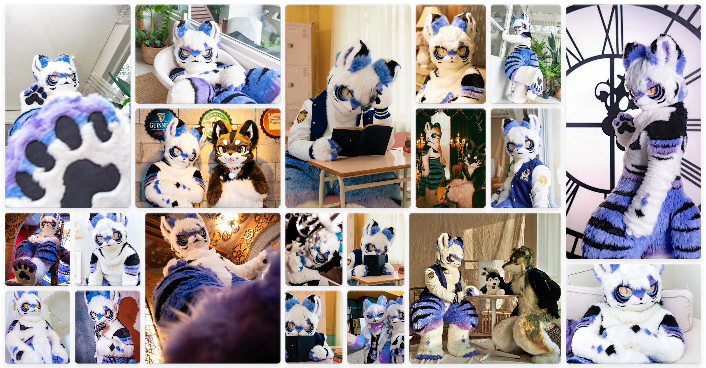

# Partitioned Container Bands



A sophisticated image gallery layout system that automatically arranges collections of mixed aspect ratio images into harmonious, responsive galleries.

[Live demo link](https://curioustorvald.com/partband/)

## Overview

The Partitioned Container Bands system solves the challenge of displaying large image collections with varying aspect ratios. Unlike traditional grid or masonry layouts that force images into rigid structures, this system creates intelligent bands that adapt to their content while maintaining visual balance across all devices.

## Key Features

- **Aspect Ratio Preservation** - Images maintain their natural proportions with intelligent soft-clipping for extreme ratios
- **Hierarchical Composition** - Priority-based placement ensures important images receive optimal positioning
- **True Responsive Design** - Layouts regenerate rather than simply scale, optimising for each viewport
- **Automatic Optimisation** - Multi-phase refinement minimises distortion and maximises visual harmony

## How It Works

The system divides galleries into horizontal or vertical bands, each containing one or more images arranged according to compositional rules. Images are automatically selected based on aspect ratio compatibility with available spaces, then refined through optimisation passes that minimise distortion.

## Usage
On your HTML:
```html
<head>
  ...
  <link rel="stylesheet" href="band.css" />
  <script src="common.js"></script>
  <script src="band.js"></script>
</head>
<body onload="pack('gallery_id', prefix, disable_NSFW_filtering?">
  ...
  <gallery id="gallery_id"></gallery>
  ...
</body>
```
On your (prefix).json
```json
{
"prefix":"photos",
"lastupdate":"2025-06-08 05:51 UTC",
"arts":[
{"ord":10010, "year":2022, "dim":"1800/2400", "author":"PictureAuthor", "epic":0},
{"ord":10020, "year":2023, "dim":"3600/2200", "author":"PictureAuthor", "epic":20},
{"ord":10030, "year":2024, "dim":"7680/4320", "author":"PictureAuthor", "epic":100},
...
]
}
```
On `band.js`:
Edit the `toImageURL(prefix, ord)` to point to your bin of images
```js
function toImageURL(prefix, ord) {
  return `https://yourwebhost/for/images/${prefix}_thumbs/${ord}.webp`
}
```
## Documentation

For the comprehensive explanation of the algorithm, implementation details, and design philosophy, please refer to the full article in this repository.

## Licence

Partitioned Container Band is freely available under the terms of the MIT Licence.
